# 📱 Todo-ReactNative

A cross-platform **To-Do List App** built using **React Native** with **TypeScript** for the frontend, and **Node.js (Express)** for the backend API.

---

## 🚀 Features

### 🔐 Authentication

- Welcome screen
- Register new users
- Login with credentials

### ✅ Task Management

- Create, edit, and delete **Tasks**
- Mark tasks as **Completed**
- View **Today’s Tasks**
- Filter by task **Status**

### 🗂️ Category Management

- Create, edit, and delete **Categories**

---

## 📄 App Screens

- Welcome Screen
- Register Screen
- Login Screen
- Home (Task Overview)
- Today’s Tasks
- Category Management(Create, edit, and delete)
- Task Details
- Completed Tasks View

---

## 🛠️ Tech Stack

### Frontend:

- React Native
- TypeScript

### Backend:

- Node.js
- Express.js

---

## 📦 Installation

### Frontend

````bash
cd frontend
npm install
npm run


### Backtend

```bash
cd backend
npm install
npm run start


---

## 📸 Screenshots

<div style="display: flex; flex-direction: 'row';">
    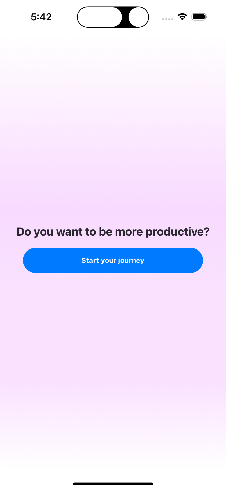
    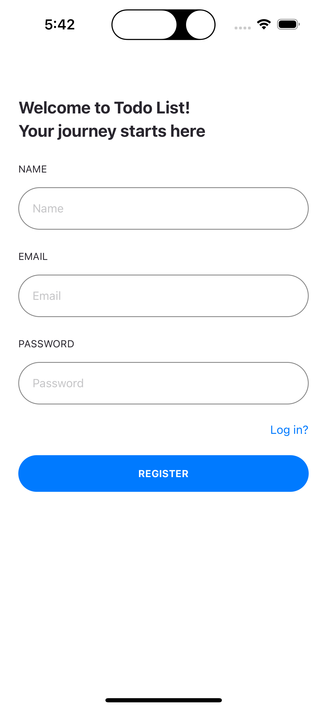
    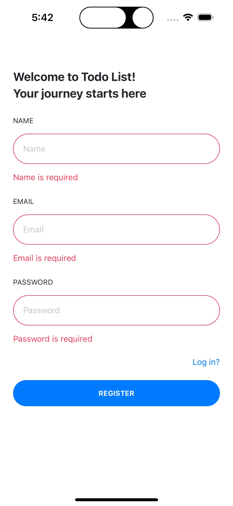
    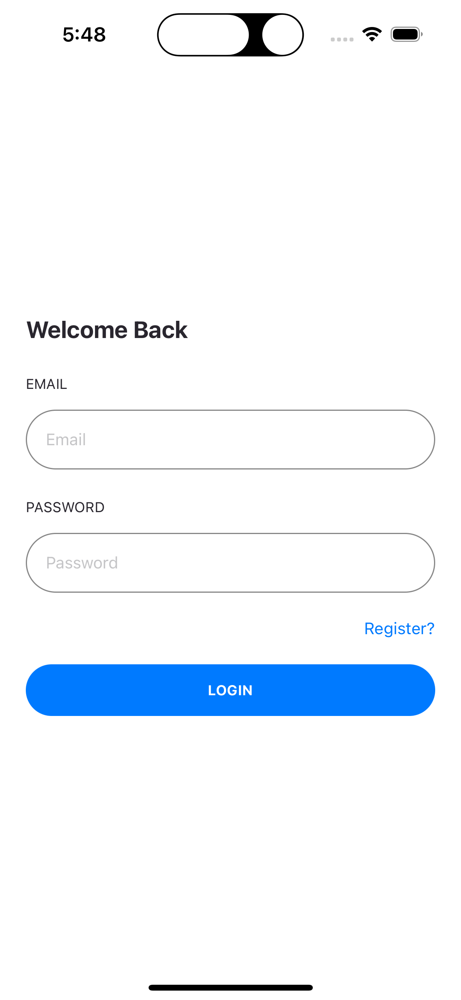
    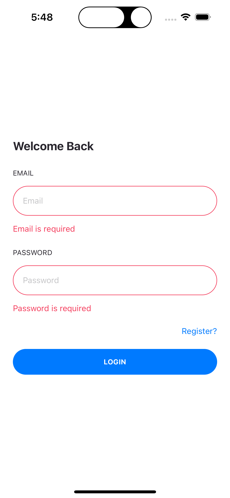
    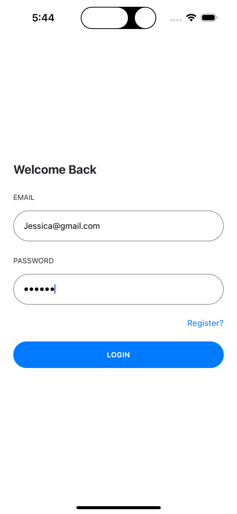
    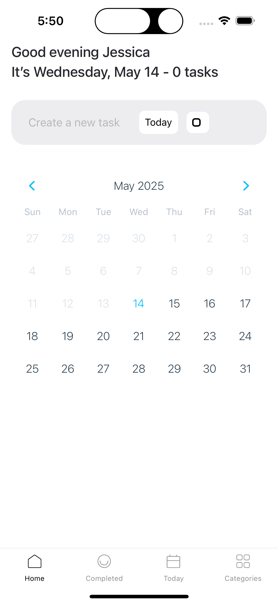
    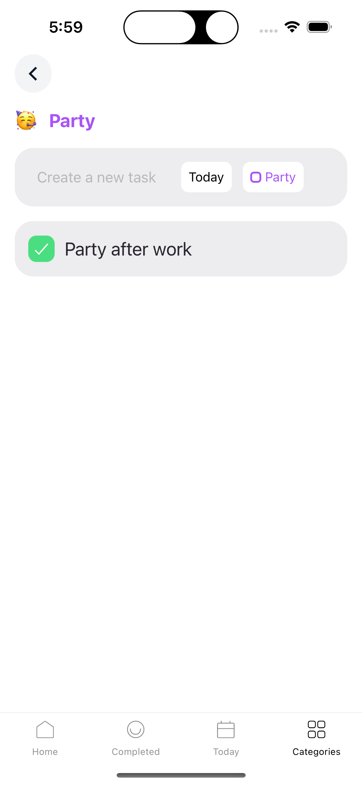
    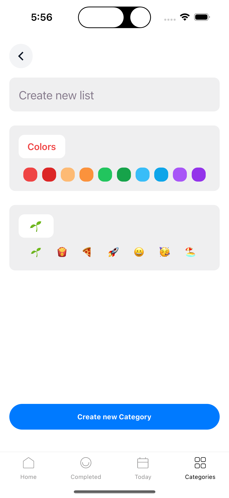
    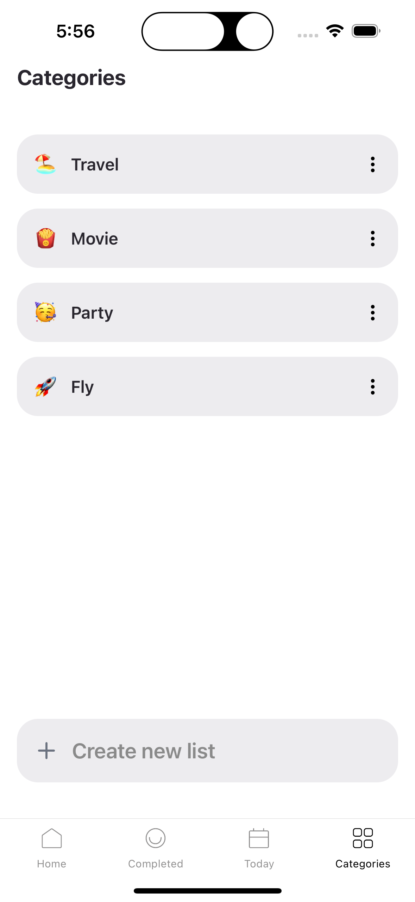
    
    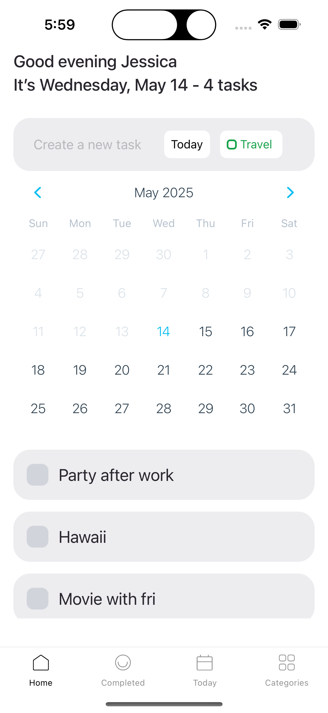
</div>

---
````
